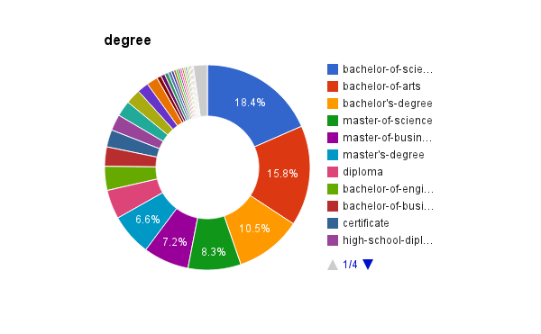
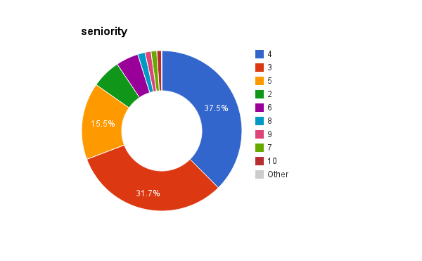

# Feature Frequency Statistics

## How to generate this report

This report is generated by running AWK scripts in this directory on
LinkedIn Employee Profile data at
`hmm/exp/linkedin_employee_data/data/pos_and_edu_for_LI_employees.txt`.

For exmaple, we run the following commands to compute frequencies of
features in form of "company=xxx", where xxx denotes a company ID:

    gawk -f company.awk ../data/pos_and_edu_for_LI_employees.txt | \
      sort -k2 -g -r > ./csv/company.csv

Then we can use Google Docs to import ./csv/company.csv and visualize
the freqency statistics.

## Feature frequencies by input properties

Please ignore gray sectors, which are aggregation of many tiny
sectors.  Also, please ignore sectors with label “-9”, that is a
special value used by Dacheng to indicate “none” and wouldn’t form a
feature.

## Conclusion

From these figures, we see the follow overwhelming inputs (basic features):

1. company: 145411
1. School:
1. Education rank: 1, 2, 3
1. Title:
1. Degree:
1. Seniority: 4, 3, 5
1. Degree rank: 2, 3
1. function: 25, 8
1. field: 42

